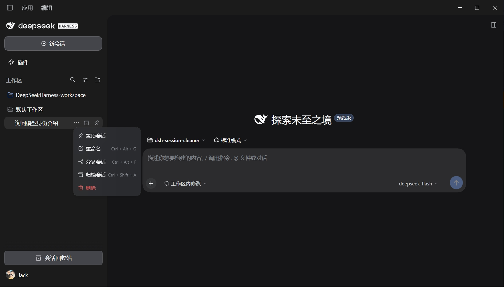
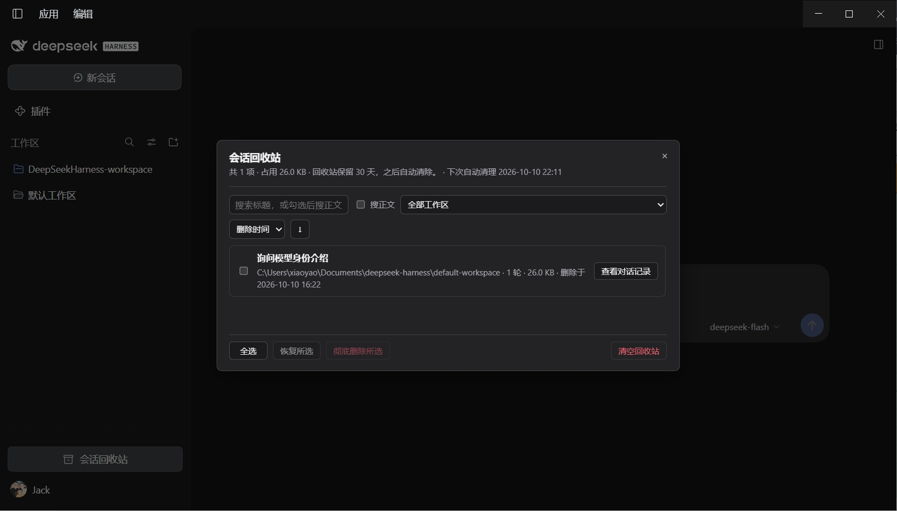
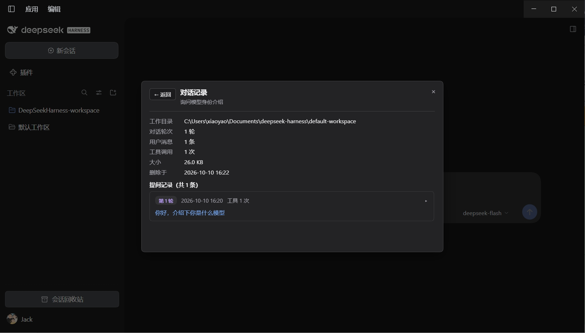

# dsh-session-cleaner

**简体中文 | [English](README.en.md)**

把「DSH 会话清理」装进 DSH 桌面版：侧栏每个会话的 `···` 菜单里多一项红色的**删除**（排在"归档"下面），一键移入回收站；侧栏底部有**会话回收站**入口，支持搜索、恢复与彻底删除。

删除不只是搬走日志目录：会话在 DSH 里留下的每一处痕都会一并处理——工作区记账槽位、置顶、归档标记、投影缓存行（含宿主留下的 `.bak` 备份）。恢复时逐项还原，包括**侧栏里的原位置**。彻底删除时再清掉绑定该会话的定时任务，以及空掉的工程目录。

## 截图



会话 `···` 菜单里多出红色的**删除**（排在"归档"下面）。



**会话回收站**：标题/正文搜索、工作区筛选、排序、恢复与彻底删除。



**查看对话记录**：逐轮提问与助手回复，Markdown 渲染，超长回复中间省略。

以上图片由本仓库根目录的 `screenshots.json` 声明（插件市场详情页按它展示），路径相对该文件、指向仓库内的图片。

## 下载

到 [Releases 页面](https://github.com/jackxiao17/dsh-session-cleaner/releases/latest) 下载最新版压缩包并解压，得到 `dsh-session-cleaner/` 文件夹；也可以 `git clone` 本仓库。

## 安装

1. 把 `dsh-session-cleaner/` 整个文件夹拷到 `~/.dsh/profiles/desktop/local/` 下（Windows 即 `C:\Users\你\.dsh\profiles\desktop\local\dsh-session-cleaner\`）
2. 编辑 `~/.dsh/profiles/desktop/package.json`：
   - `dependencies` 里加一行：`"dsh-session-cleaner": "file:./local/dsh-session-cleaner"`
   - `dsh.profile.bundles` 数组里加一项：`"dsh-session-cleaner"`
3. 在该目录跑一次 DSH 自带的 pnpm：
   ```
   node "%DSH_HOME%\dsh-runtimes\dsh-primary-runtime\dependencies\pnpm\bin\pnpm.cjs" install -C %DSH_HOME%\profiles\desktop
   ```
4. 重启 DSH 生效；在 DSH 的插件管理页可见

## 用法

1. 点会话 `···` → **删除**：直接移入回收站，顶部提示"✓ 会话已删除至回收站"（可恢复，所以无二次确认）
2. 对话中的会话也能删：会先结束当前回答（取消这一轮 + 拆掉 agent），再移入回收站
3. **会话回收站**（侧栏底部按钮）：
   - 搜索：标题实时过滤；勾选「搜正文」后按关键词搜提问与回复内容
   - 工作区筛选、按删除时间/标题/大小/轮次排序（可倒序）
   - 勾选后底部**恢复所选 / 彻底删除所选**（有确认），也可一键清空
4. **查看对话记录**：每条会话的"查看对话记录"打开逐轮提问与助手回复（Markdown 渲染，超长回复中间省略，正文关键词仍可搜到）
5. 恢复：目录搬回原位、记账挂回原工作区**并回到原来的槽位**、投影缓存行原样还原、置顶与归档状态还原（删除前是归档的，恢复到归档列表；提示会说明去哪了）
6. 回收站保留 **30 天**：启动时清一次，之后每 **6 小时**清一次（DSH 长期不重启也不会漏清）；面板会显示下次自动清理的时刻

## 删除 / 恢复 / 彻底删除，各自动了什么

| 位置 | 移入回收站 | 恢复 | 彻底删除 |
|---|---|---|---|
| `<dshHome>/sessions/<项目段>/<会话id>/` | 整体 `rename` 到回收站（同盘瞬时，不复制） | 搬回原位 | 删除 |
| 工作区记账号位 `workspace.json` → 工作区的 `sessionIds` | 摘掉槽位（并记下后继会话作为锚点） | 挂回并**插回原位置** | — |
| 全局归档集合 `archivedSessionIds` | 摘掉（并记下删除前是否归档） | 按原状态还原 | — |
| 全局置顶集合 `pinnedSessionIds` | 摘掉（并记下原次序） | 按原次序还原 | — |
| 投影缓存行 `storages/session_projcache/sessions/<id>.json` | 通过宿主存储域删除，快照留原文 | 原文写回（文件 + 宿主内存表） | 复查并清掉（含 `<id>.json.bak.*`） |
| 绑定该会话的定时任务（`schedule` 域） | **不动**：快照里抄录一份 | 不用还原（从未被动过） | 清掉（进行中的 + 已结束的历史行） |
| `<dshHome>/sessions/<项目段>/` 工程目录 | — | 需要时重建 | 空了就删掉 |

## 已知边界

- DSH 的插件接口没有官方稳定性承诺，大版本升级后插件可能失灵——失灵表现为菜单项/按钮消失或操作报错，不会伤及会话数据
- 回收站会占磁盘空间（面板顶部显示总占用），靠 30 天保留期兜底
- **定时任务在会话进回收站期间不会被清掉**：宿主对"会话已不存在"的到期任务只会记一条 warn，不会重建会话，也不会自动重试；要彻底清掉请用"彻底删除"。之所以不在"移入回收站"这一步删，是因为宿主的 `schedule` 服务**不支持原样重建任务**（新建会换 id、清空发送历史），删了就回不来了，而移入回收站必须是可逆的
- **恢复不保证与删除前逐字节相同的地方**：若删除前它处于归档状态，恢复后回到归档列表（不会跳进侧栏）；若原锚点会话已被删除，恢复后停在侧栏顶部（面板会如实回报"位置未还原"）
- **同 id 有两份日志目录时拒绝操作**：这是宿主自己都拒绝解析的损坏状态，插件会列出来让你先手工处理，而不是删掉一份、留下另一份却报成功
- **崩溃安全**：快照先写、文件后搬，之后再把快照升级为完成态；启动时做一次双向对账——"没搬成"的残留快照会回滚，回收站里缺快照的孤儿目录会被收编成"数据不完整"条目（可见、可彻底删除，但不能恢复，因为原路径已无从得知）
- **0.7.0 移除了两个没人调用的 HTTP 端点**：`POST /delete`（不进回收站的物理删除）与 `POST /status`。现在删除只有一条链：移入回收站 → 彻底删除
- 只在本机桌面版（`dsh web` 的 web profile）上验证过；没在别的部署形态上测过

## 卸载 / 回滚

1. 从 `~/.dsh/profiles/desktop/package.json` 里删掉 `dsh-session-cleaner` 的 dependencies 行、bundles 行
2. 在该目录跑 `pnpm install`（用 DSH 自带的：`node "%DSH_HOME%\dsh-runtimes\dsh-primary-runtime\dependencies\pnpm\bin\pnpm.cjs" install -C %DSH_HOME%\profiles\desktop`）
3. 重启 DSH。本地文件可整个删掉 `~/.dsh/profiles/desktop/local/dsh-session-cleaner\`

## 开发与同步（源码在别处迭代时看这节）

本仓库就是插件的开发源码。改完代码后，DSH **不会**自动加载新版本，必须手动把整个插件文件夹覆盖拷贝到以下**两处**，再重启 DSH：

1. `~/.dsh/profiles/desktop/local/dsh-session-cleaner\`（安装源，Windows 即 `C:\Users\你\.dsh\profiles\desktop\local\` 下）
2. `~/.dsh/profiles/desktop/node_modules/dsh-session-cleaner\`（DSH 实际加载的目录）

要点：

- **纯代码改动不需要重跑 pnpm install**，覆盖文件 + 重启 DSH 即可。只有第一次安装、或改了 package.json 的依赖时才需要再跑一次：`node "%DSH_HOME%\dsh-runtimes\dsh-primary-runtime\dependencies\pnpm\bin\pnpm.cjs" install -C %DSH_HOME%\profiles\desktop`
- **为什么必须拷两处**：这两个目录里的同名文件是硬链接关系（同一份磁盘数据），但如果拷贝方式是"先删旧文件再放新文件"（不少工具的安全保存就是这个行为），硬链接会被切断，结果 local 是新版、node_modules 还是旧版，DSH 加载的仍是旧代码。两处都覆盖就不会有这个问题。
- **迭代时顺手把版本号升一位，共两处**：`package.json` 的 `version`，以及 `lib/index.js` 里的 `buildId`。插件启动时会在日志里打印 `dsh-session-cleaner v<版本号>`，重启后一眼就能确认新版本真的生效了（2026-10 出过 `package.json` 已升、`buildId` 忘升导致日志仍显示旧版号的问题，两处务必一起改）。
- 改动确认无误后提交推送到本仓库，保证 GitHub 上的代码和你本机跑的一致；发版时标签、Release 与 zip 包里的版本号也要跟着对齐。

### 一键发版脚本

`scripts/release.ps1` 是维护者工具（不参与插件运行，也不会被装进发行包——`package.json` 的 `files` 只列了 `lib`、`cordis.patch.yml`、`README.md`、`README.en.md`）。它按顺序做完这几件事：

1. 校验 `package.json#version` 与 `lib/index.js#buildId` 一致（不一致直接报错，防止再出现"日志显示旧版本号"）；
2. 打包出 `dsh-session-cleaner-<版本>.zip` 并打印 SHA256；
3. 覆盖同步到 `~/.dsh/profiles/desktop/` 下的 `local\` 与 `node_modules\` 两处；
4. `git commit` → 打 `v<版本>` 标签 → 推送 main 与标签；
5. 创建 Release（标题统一为 `dsh-session-cleaner v<版本>`）并上传 zip。

```powershell
# 先干跑看一遍将要做的事（不改任何东西）
pwsh -NoProfile -File scripts/release.ps1 -DryRun

# 正式发版
pwsh -NoProfile -File scripts/release.ps1
```

参数：`-SkipGit`、`-SkipSync`、`-SkipRelease` 可分别跳过某一步；`-Proxy ''` 关闭代理（默认走 `http://127.0.0.1:7890`）；`-Token` 或环境变量 `GH_TOKEN` 指定令牌，都没有时脚本会尝试读取 Windows 凭据管理器里 `git:https://github.com` 的令牌（只放环境变量，不打印、不进命令行历史），仍取不到则跳过 Release 创建并提示手工上传。

### 改完代码先跑一遍验证台

`scripts/verify.mjs` 是维护者工具（不参与插件运行，也不会被装进发行包）。它用 mock 宿主 + 真实临时目录把关键路径真跑一遍：路径校验、移入回收站、恢复（含槽位/置顶/归档/缓存行还原）、彻底删除（含定时任务与空目录）、并发锁、重复目录拒绝、启动对账、保留期清理、真实 DSH 日志帧解析，以及客户端 bundle 的 slot 注册与双语语言包一致性。

```powershell
node scripts\verify.mjs
```

全绿（末行 `N 通过 / 0 失败`）再发版。

## 更新记录

### 0.7.0（深度清理）

- **投影缓存行真的会删了**：以前只有没人调用的 `/delete` 端点会删它，界面上走得到的路径从不删；现在移入回收站时通过宿主存储域删除，并连带清掉宿主的 `<id>.json.bak.*` 备份
- **置顶不再变成悬空引用**：删除时摘掉 `pinnedSessionIds`，恢复时按原次序还原
- **恢复回到侧栏原位置**：记下后继会话作锚点，恢复时用 `insertSessionBefore` 插回原位（`attachSession` 只会前插）
- **恢复会还原归档状态**：删除前是归档的，恢复后回到归档列表，提示文案会说明
- **彻底删除会清掉绑定该会话的定时任务**（进行中 + 已结束的历史行），并删掉空掉的工程目录
- **保留期由"只在启动时清"改为"启动 + 每 6 小时"**，面板显示下次清理时刻
- **崩溃安全与启动对账**：快照先写后搬；启动时双向对账——回滚没搬成的假条目、收编缺快照的孤儿目录、清掉残留临时文件
- **同 id 有多份日志目录时拒绝操作**并列出路径，而不是删一份、留一份却报成功
- **锁统一到按会话 id**：恢复与彻底删除不再可能交错；批量操作先占批量位、再逐条占会话位
- 移除了无人调用的 `POST /delete` 与 `POST /status` 两个端点
- 修正了源码头注释里"运行中的会话一律拒绝删除"的过期描述（实际行为是结束当前回答后删除）

## License

[MIT](LICENSE)
